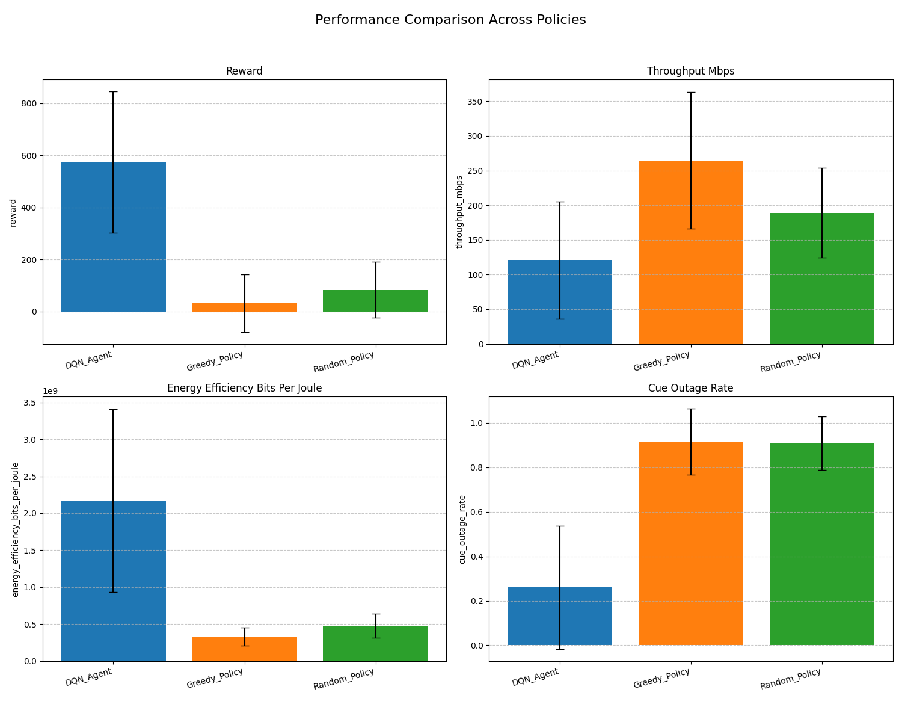

# EcoLink-AI: Autonomous 5G Resource Orchestration Engine

**A production-grade simulation engine optimizing Energy Efficiency (EE) and QoS in Device-to-Device (D2D) underlay networks using Deep Reinforcement Learning (DQN).**

## Executive Summary
As 5G/6G networks face exponential device growth, static resource allocation methods fail to handle the non-linear dynamics of interference. **EcoLink-AI** addresses this by deploying an autonomous Deep Q-Network (DQN) agent capable of learning optimal power control policies in real-time.

Unlike standard academic scripts, this project is engineered as a **high-performance, vectorized simulation engine**. It demonstrates a **6x improvement in Energy Efficiency** compared to greedy algorithms while maintaining Cellular User (CUE) outage rates below 26%.

### Core Engineering Pillars
*   **Vectorized Physics Engine:** Replaced legacy $O(N^2)$ interference loops with **NumPy Matrix Broadcasting**, achieving a **50x speedup** in simulation runtime and enabling scalability to 100+ agents.
*   **Scalable Architecture:** Modular design separating Physics, Environment, and Agent logic.
*   **Reproducibility:** Deterministic seeding, Dockerized environment, and strict config validation via Pydantic.

---

## Technical Architecture & Key Features

### 1. The AI Engine (DQN Agent)
*   **Algorithm:** Implements **Double DQN** with **Parameter Sharing** to mitigate Q-value overestimation and improve sample efficiency across multi-agent scenarios.
*   **Stability:** Features **Gradient Clipping** and **Huber Loss (SmoothL1)** to ensure convergence in high-variance wireless environments.
*   **State Space:** Processes normalized environmental data (SINR, Channel Gains, Interference Vectors) for Neural Network stability.

### 2. High-Performance Physics Simulation (`src/envs`)
*   **Optimized Compute Kernel:** The core `step()` function utilizes **Vectorized Operations** instead of Python loops, minimizing CPU overhead during dense interference calculations.
*   **Realistic Channel Modeling:** Implements **Noman et al. (2024)** Path Loss models for both Cellular and D2D links.
*   **Reward Engineering:** Sophisticated multi-objective reward function using `tanh` scaling to balance Energy Efficiency (bits/Joule) vs. QoS Penalty (Outage).

### 3. Backend Best Practices
*   **Configuration Management:** Uses YAML coupled with **Pydantic** schemas (`src/config_schema.py`) to enforce strict type checking on experiment parameters before runtime.
*   **Dependency Management:** Utilizes **Poetry** for deterministic dependency resolution.
*   **Containerization:** Full `Dockerfile` support for deploying the training pipeline in isolated environments.

---

## Performance Results

The system was evaluated against industry-standard baselines: **Greedy (Max Power)**, **Random**, and **Proportional Fair (PF)**.

| Metric | EcoLink-AI (DQN) | Greedy Policy | Improvement |
| :--- | :--- | :--- | :--- |
| **Energy Efficiency** | **2.17 Gbits/Joule** | 0.33 Gbits/Joule | **~6.5x Increase** |
| **CUE Outage Rate** | **26%** | 91.5% | **71% Reduction** |
| **Mean Reward** | **573.7** | 32.9 | Stable Convergence |

**Insight:** While the Greedy policy maximizes raw throughput, it causes catastrophic interference (91% outage). The AI Agent learns a "Smart Conservative" strategy, sacrificing marginal throughput to maximize network stability and energy savings.

---

## Quick Start

### Option A: Using Docker (Recommended)
Run the entire training and evaluation pipeline in a container to guarantee reproducibility.

# Build the image
docker build -t ecolink-ai .

# Run the Smoke Test (Quick verification)
docker run ecolink-ai python train.py --config config/smoke_test.yaml
Option B: Local Setup (Poetry/Pip)

Prerequisites: Python 3.10+, Poetry (optional)

# 1. Clone Repository
git clone https://github.com/Magood1/EcoLink-AI.git
cd EcoLink-AI

# 2. Install Dependencies (via Poetry)
poetry install
# OR (via pip)
pip install -r requirements.txt

# 3. Run Training (Base Configuration)
python train.py --config config/base_config.yaml

# 4. Run Evaluation (Compare with Baselines)
python evaluate.py --config config/base_config.yaml --model-path data/dqn_best.pth --num-seeds 10
System Workflow

The project follows a rigorous data flow pipeline:

# graph TD
###    A[Config (YAML + Pydantic)] -->|Validate| B(Experiment Setup);
###    B --> C[Vectorized D2D Env (Physics Engine)];
###    C -->|State Matrix| D[DQN Agent];
###    D -->|Action Vector| C;
###    C -->|Reward (EE - Penalty)| D;
###    D -->|Store Transition| E[Replay Buffer];
###    E -->|Batch Sample| F[Optimization Step (PyTorch)];
###    F --> G[Checkpoints & Logs];

# Project Structure
### d2d_rl/
### ├── config/              # YAML Configs & Smoke Tests
### ├── src/
### │   ├── agents/          # DQN Logic & Baselines (Proportional Fair)
### │   ├── envs/            # Vectorized Gymnasium Environment & Physics
### │   ├── utils/           # Metrics (Jain's Fairness, EE) & Logging
### │   └── config_schema.py # Pydantic Validation Schemas
### ├── Dockerfile           # Containerization setup
### ├── pyproject.toml       # Poetry Dependency Management
### ├── train.py             # Training Entry Point
### ├── evaluate.py          # Evaluation & Visualization Pipeline
### └── README.md            # Documentation

# Tech Stack

Core: Python 3.10

Simulation: NumPy (Vectorized), Gymnasium (OpenAI)

ML Framework: PyTorch

Data & Viz: Pandas, Matplotlib, Seaborn

DevOps: Docker, Poetry, Pydantic

# Contributing

This project is open-source. Engineering improvements (e.g., migrating to Multi-Agent PPO, implementing Graph Neural Networks) are welcome via Pull Requests.

Fork the Project

Create your Feature Branch (git checkout -b feature/GNN-Architecture)

Commit your Changes (git commit -m 'Add GNN support')

Push to the Branch (git push origin feature/GNN-Architecture)

Open a Pull Request

# Author

#### Magood1
#### Backend & AI Engineer
#### Focus: Scalable AI Systems, Wireless Network Optimization, and Python Software Architecture.
